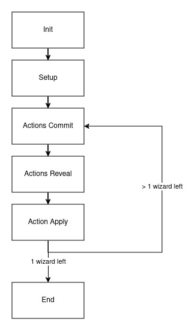

# Wizzard battle

Wizzard battle is a ZK game that was created during Encode ZK Bootcamp project by Group 6.

## Rules

- Each wizard live within a field 4x4
- Each wizard have 3 health. When health goes to zero he dies. Health is public
- Each wizard have a spells. He can choose 2 before match starts
- There is only one winner

## State model

- **Init** Users public keys set
- **Setup** Users inital state set + InitialStateProof check
- **Action Commit** At this stage users send commitment(hash of action + salt) of their actions for the next turn + proof of commitment
- **Action Reveal** At this stage users send actions, that were commited earlier
- **Action Apply** At this stage users send proofs of their health after all actions applying. If one or less wizard alive, goes to **End** phaze, otherwize goes to **Action Comit**
- **End**



## Data structures

We are using Mina, so we are seriously limited with space we have.

1. Merkle map root of players, so we can check both user and their index
2. Status. One of GameStatus options
3. Merkle map of players state. Player state is private data of each player. Indexes are the same as in players merkle map.
4. Merkle map of commits
5. Merkle map of actions
6. Health info of all users packed into single Field
7. Number of alive players
8. Number of player that is still didn't make a move in this phaze

## Proofs

- **Initial state proof**. Proof that position and spels is correct
- **Commitment proof**. Proof that player can perform action that he is commiting
- **Action apply proof**. Proof of health after round

## How to build

```sh
npm run build
```

## How to run tests

```sh
npm run test
npm run testw # watch mode
```

## How to run coverage

```sh
npm run coverage
```

## License

[Apache-2.0](LICENSE)
